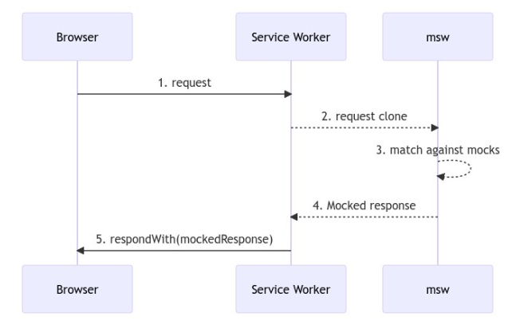

## Test Driven Development (테스트 주도 개발)
- 개발 (코드 작성) 전 테스트 코드를 먼저 작성하여 개발해나가는 방식
- 테스트 코드 작성 - 테스트 수행 실패 - 실패한 테스트 코드가 성공할 수 있도록 기능 로직 작성 - 테스트 성공 - 다음 기능 테스트 코드 작성 사이클을 계속 진행
- 요구사항 분석 및 이해를 필요로하기 때문에 목표에 대해 점검이 가능
- 작은 테스트 단위로 나누어 개발하기 때문에 테스트 로직을 통해 팀원이 보다 빠른 로직 파악이 가능

## React Testing Library
- React 컴포넌트를 테스트하기 위해 설계된 라이브러리
- DOM Testing Library (DOM 노드를 테스트하기 위한 솔루션) 위에 구축됨
- Create React App으로 프로젝트 생성시 기본적으로 내장되어 있음
- 행위 주도 테스트 (어떠한 이벤트를 발생시켰을 때 화면이 어떻게 변화되는지에 초점을 맞춘 테스트 방식)
- JEST(페이스북에서 만든 테스트 케이스 작성을 위한 자바스크립트 테스팅 프레임워크) 와 함께 사용.
  아래 코드에서 expect(...).toOOOO()를 통해 값을 검증할 수 있다.
```js
import { render, screen, fireEvent } from '@testing-library/react';
import App from './App';

test('the counter starts at 0', () => {
  render(<App />);
  // screen object를 이용해서 원하는 엘리먼트에 접근(접근할 때 TEST ID로)
  const counterElement = screen.getByTestId('counter');
  // test id가 counter인 엘리먼트의 텍스트가 0인지 테스트
  expect(counterElement).toHaveTextContent('0');
});

test('when the + button is pressed, the counter changes to 1', () => {
  render(<App />);
  const buttonElement = screen.getByTestId('plus-button');
  fireEvent.click(buttonElement);
  const counterElement = screen.getByTestId('counter');
  expect(counterElement).toHaveTextContent('1');
})

test('on/off button has blue color', () => {
  render(<App />);
  const buttonElement = screen.getByTestId('on/off-button');
  expect(buttonElement).toHaveStyle({ backgroundColor: 'blue' });
})

test('Prevent the -,+ button from being pressed when the on/off button is clicked', () => {
  render(<App />);
  const buttonElement = screen.getByTestId('on/off-button');
  fireEvent.click(buttonElement);

  const plusButtonElement = screen.getByTestId('plus-button');
  expect(plusButtonElement).toBeDisabled();

  const minusButtonElement = screen.getByTestId('minus-button');
  expect(minusButtonElement).toBeDisabled();
})
```

### Queries
- element 를 찾기위한 일종의 셀렉터 함수
- get / query / find 세가지 종류가 있음
  - get: element 가 없으면 에러 발생
  - query: element 가 없으면 null 반환
  - find: promise를 반환함. element 가 없거나 1000초 후에 둘 이상 발견시 reject 됨
- 2개 이상을 찾을 때는 getOOOAll 사용
- query를 통해 DOM을 가져와서 JEST의 matcher를 이용해 값을 검증함
- 비동기적으로 변화되거나 가져오는 경우 find를 사용
```js
const errorBanner = await screen.findByTestId('error-banner'); // 쿼리 사용 예시
```
```js
const productImages = await screen.findAllByRole('img', {
  name: /product$/i
});
const altTextList = productImages.map((el) => el.alt); // 찾고자하는 element가 2개 이상일 때 쿼리 사용 예시
```


### User Actions
- 사용자의 이벤트라 가정하고 이벤트를 발생시켜 이후의 변경되는 값 등을 테스트할 수 있음
- fireEvent와 userEvent 두가지 방식이 있으며 userEvent가 hover, focus 이벤트가 호출되는 등 보다 더 사용자 입장에서 사용할 수 있어
  이벤트를 발생시키고 변경 테스트하는 기본적인 케이스에서는 user-event를 더 권장한다.
```js
  const confirmCheckbox = screen.getByRole("checkbox", {
    name: "주문하려는 것을 확인하셨나요?",
  });
  userEvent.click(confirmCheckbox);

  const confirmOrderButton = screen.getByRole("button", {
    name: "주문 확인",
  });
  userEvent.click(confirmOrderButton);

  ////////////////////   주문 완료 페이지   //////////////////
  const loading = screen.getByText(/loading/i);
  expect(loading).toBeInTheDocument();

  const completeHeader = await screen.findByRole("heading", {
    name: "주문이 성공했습니다.",
  });
  expect(completeHeader).toBeInTheDocument();
```

### Mock Service Worker
- 서버로 향하는 실제 네트워크 요청을 가로채서 모의 응답을 하는 라이브러리
- 브라우저에서 서비스워커를 등록하여 외부로 나가는 네트워크 리퀘스트를 감지 후 그 요청을 서버로 갈 때 가로채서 MSW 로 보냄. 등록된 핸들러에서 요청을 처리한 후 모의 응답을 브라우저로 보냄
  
- [브라우저와 통합](https://mswjs.io/docs/api/setup-worker)하는 방법과 아래 작성된 노드 서버와 통합하는 방법 두가지가 있다.


```js
// 모의 응답 핸들러를 생성하여 node 서버 setup
const handlers = [
  rest.get('http://localhost:5000/products', (req, res, ctx) => {
    return res(
            ctx.json([
              {
                "name" : "America",
                "imagePath" : "/images/america.jpeg"
              },
              {
                "name" : "England",
                "imagePath" : "/images/england.jpeg"
              }
            ])
    )
  }),
  rest.get('http://localhost:5000/options', (req, res, ctx) => {
    return res(
            ctx.json([
              {
                "name" : "Insurance"
              },
              {
                "name" : "Dinner"
              }
            ])
    )
  }),
]
export const server = setupServer(...handlers);

// 모든 테스트를 시작하기 전에 서버 실행 (Establish API mocking before all tests.)
beforeAll(() => server.listen());


// 테스트 실행시 리퀘스트 핸들러를 리셋하여 다른 테스트에 영향이 가지 않도록함
// (Reset anu request handlers that we may add during the tests,
// so they don't affect other tests.)
afterEach(() => server.resetHandlers());

// 테스트 수행 후 서버 종료 (Clean up after the tests are finished)
afterAll(() => server.close());
```

```js
// msw로 생성한 mock api에 요청하는 예시
const loadItems = async (orderType) => {
  try {
    let response = await axios.get(`http://localhost:5000/${orderType}`);
    setItems(response.data);
  } catch(e) {
    setError(true);
  }
}
```

# Reference
- [React Testing Library](https://testing-library.com/docs/react-testing-library/intro/)
- [Mock Service Worker](https://mswjs.io/docs/#request-flow-diagram)