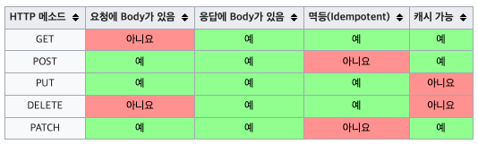

# REST API

## REST
HTTP URI를 통해 자원을 명시하고 HTTP Method를 통해 해당 자원에 대한 CRUD Operation을 적용하는 것

## REST API
REST 기반으로 서비스 API
- URI는 정보의 자원을 표현
- 자원에 대한 행위는 HTTP Method(GET, POST, PUT, DELETE)로 표현
```
DELETE /members/1
```
## HTTP Method


상황에 맞게 HTTP Method를 사용
GET(Read), POST(Create), PUT or PATCH(Update), DELETE(Delete)
---
멱등성은 예시를 들어 특정 API를 2번 이상 중복 요청하여도
서버에서 로직이 수행되었을 때 결과가 달라지지 않는 것을 말한다.
여기서 말하는 결과는 http 응답을 말하는 것이 아니고 로직에서 업데이트하려는 데이터 또는 상태의 값 (예: DB에 저장된 값) 


# Reference
- [위키피디아 - HTTP](https://ko.wikipedia.org/wiki/HTTP)
- [REST API란? REST, RESTful이란?](https://khj93.tistory.com/entry/네트워크-REST-API란-REST-RESTful이란)