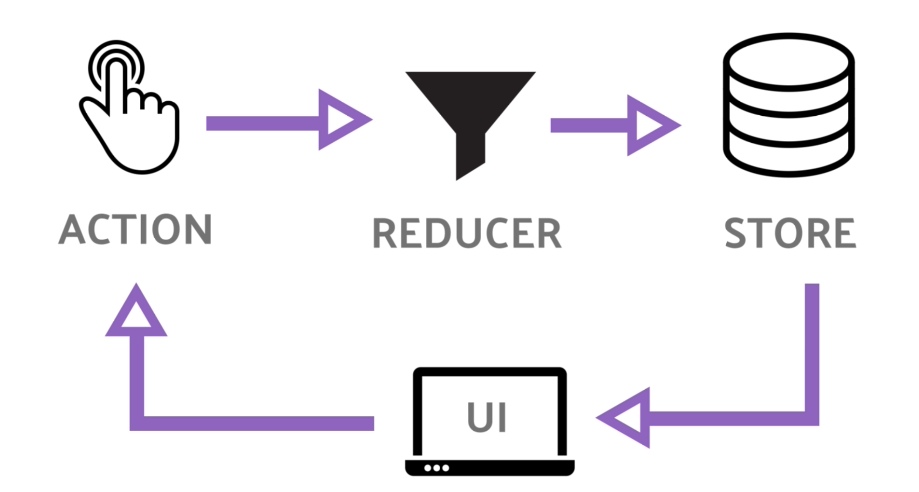

# Redux

: Javascript 상태 관리 라이브러리

- Redux의 본질은 Node.js 모듈
- 무조건 React와 함께 사용할 필요는 없음. 일반 JS 환경에서도 사용 가능
- Redux의 기본 원칙
    1. `Single source` of truth : `store`라는 하나뿐인 데이터 공간
    2. State is `read-only` : `setState()`를 통해 state를 변경하는 것이 아닌, `action`을 통해 state를 변경
    3. Changes are made with `pure functions` : 변경은 순수함수로만 가능(Store - Action - Reducer)


### 1. Store

- Store : 상태가 관리되는 오직 하나의 공간
    - 컴포넌트와는 별개로 스토어라는 공간이 있어서 그 스토어 안에 앱에서 필요한 상태를 담는다.
    - 컴포넌트에서 상태 정보가 필요할 때 스토어에 접근한다.
        
        ```tsx
        const store = redux.createStore( rootReducer );//store 생성
        console.log(store.getState())//0 (현재 state 가져오기)
        
        store.dispath({type:TEST})
        console.log(store.getState())//1
        ```
        
    1. `createStore`로 store를 만들고 reducer에서 새로운 state값 반환 
    -> store에 저장되어 있는 현재 store값이 업데이트
    2. store는 state를 관리해주고 `setState` 메소드로 현재 state를 가져오며 `dispatch`를 통해 state를 업데이트
    3. store가 변경되면 `dispatch`가 store의 subscribe메소드를 통해 변경된 state값으로 다시 render해줌

### 2. Action

- Action : 앱에서 스토어에 운반할 데이터
    - JS 객체 형식으로 되어 있음
    
    ```tsx
    {
      type: 'ACTION_CHANGE_USER', // 필수
      payload: { // 옵션
        name: '하나몬',
        age: 100
      }
    }
    ```
    

### 3. dispatch

- 사용자가 입력한 action을 reducer에 전달하는 역할
    
    ```tsx
    dispatch({type:ACTION_CHANGE_USER})
    dispatch({type:ACTION_CHANGE_USER,data:'test'})// data 추가
    ```
    
- type속성은 string이며 관리하기 쉽도록 상수로 변경하여 전달
- type속성 뒤에는 data도 같이 전달할 수 있음

### 4. Reducer

- Reducer : Action의 주문을 보고 `Store`의 상태를 업데이트
    
    ```tsx
    //redux index.js
    
    export const ACTION_CHANGE_USER = 'TEST';
    
    const rootReducer = (state=0,action){
      switch(action.type){
        case ACTION_CHANGE_USER
          return state+1
        dafult:
          return state
      }
    }
    ```
    
    - Action을 dispatch하면 reducer함수 호출
    - Reducer의 장점
        1. 상태를 예측 가능하게 만든다. (순수함수를 사용하기 때문)
        2. 편한 유지보수 (복잡한 상태 관리와 비교)
        3. `redux dev tool`가 있어 디버깅에 유리
        4. 순수함수를 사용하기 때문에 테스트를 붙이기 용이
    - dispatch로 전달된 action.type에 따라 실행할 코드를 작성하면 이전state에서 변경된 state를 화인하여 새로운 state 반환
- reducer에서 순수함수로 상태 업데이트 하는 방법
    1. `Object.assign()` 이용 (depth 1까지만 깊은 복사)
        - `return Object.aissgn({},state,{새로 업데이트 할 것})`
    2. Spread 연산자 이용
        - `return {…state,{새로 업데이트 할 것})`

### 5. Redux의 장점

1. 단방향 모델링(한가지 방향으로만 바뀐다)임
action을 dispatch 할때마다 기록(history)이 남아 에러를 찾기 쉽다. 타임머신 기능을 사용할 수 있음
2. 상태의 중앙화 : 스토어(Store)라는 이름의 전역 자바스크립트 변수를 통해 상태를 한 곳에서 관리하는데, 이를 중앙화라 함. 전역 상태를 관리할때 굉장히 효과적
3. Redux는 상태를 읽기 전용으로 취급한다. 상태가 읽기 전용이므로, 이전 상태로 돌아가기 위해서는 그저 이전 상태를 현재 상태에 덮어쓰기만 하면 됨. 이런 식으로 실행 취소 기능을 구현.

### 6. Redux의 단점

1. 아주 작은 기능이여도 리덕스로 구현하는 순간 몇 개의 파일(액션등을 미리 만들어놔야함)들을 필수로 만들어야하여 코드량이 늘어난다.
2. 타임머신 기능을 사용하려면 불변성 개념을 지켜야 사용할 수 있으므로 매번 state라는 객체를 만들어줘야 함
3. Redux는 상태를 읽기 전용으로 취급할 뿐, 실제 읽기 전용으로 만들어주지는 않습니다. 때문에 상태를 실수로 직접 변경하지 않도록 항상 주의해야 합니다. 이를 예방하기 위해 Immutable.js같은 라이브러리도 존재합니다.
4. 다른 것 다 필요 없고 상태 관리를 중앙화하는 것만 있어도 된다면 Context API 를 사용

### 7. Redux팀의 다른 라이브러리

1. React-Redux
2. Redux Toolkit

### [📎 Code](https://github.com/guesung/playground/blob/master/playground/index.js)

### 8. Reducer

1. reducer : 현재 상태와 action 객체를 파라미터로 받아와서 새로운 상태를 반환해주는 함수
    - reducer가 반환하는 상태는 곧 컴포넌트가 지닐 새로운 상태
    
    ```tsx
    function reducer(state, action) {
      // 새로운 상태를 만드는 로직
      // const nextState = ...
      return nextState;
    }
    ```
    
2. action : **업데이트를 위한 정보**를 가지고 있음. 주로 type값을 지닌 객체 형태로 사용
    
    ```tsx
      // 카운터에 1을 더하는 액션
    {
      type: 'INCREMENT'
    }
    // 카운터에 1을 빼는 액션
    {
      type: 'DECREMENT'
    }
    // input 값을 바꾸는 액션
    {
      type: 'CHANGE_INPUT',
      key: 'email',
      value: 'tester@react.com'
    }
    // 새 할 일을 등록하는 액션
    {
      type: 'ADD_TODO',
      todo: {
        id: 1,
        text: 'useReducer 배우기',
        done: false,
      }
    }
    
    ```
    
3. useReducer : 복잡한 상태 관리가 필요할 경우 `useState`를 대체하여 사용할 수 있는 훅
    
    ```tsx
    const [state, dispatch] = useReducer(reducer, initialState);
    ```
    
    - `state` : 우리가 앞으로 컴포넌트에서 사용할 수 있는 상태
    - `dispatch` : 액션을 발생시키는 함수
        - `dispatch({ type: 'INCREMENT' })` 이런식으로 사용
    - `reducer` : `dispatch` 함수에 의해 실행되며, 컴포넌트 외부에서 state를 업데이트 하는 로직을 담당
    - `initialState` : 초기 상태
    - 전체 코드 예시
        
        ```tsx
        import React, { useReducer } from "react";
        
        function reducer(state, action) {
          switch (action.type) {
            case "INCREMENT":
              return state + 1;
            case "DECREMENT":
              return state - 1;
            default:
              return state;
          }
        }
        
        function Counter() {
          const [number, dispatch] = useReducer(reducer, 0);
        
          const onIncrease = () => {
            dispatch({ type: "INCREMENT" });
          };
        
          const onDecrease = () => {
            dispatch({ type: "DECREMENT" });
          };
        
          return (
            <div>
              <h1>{number}</h1>
              <button onClick={onIncrease}>+1</button>
              <button onClick={onDecrease}>-1</button>
            </div>
          );
        }
        
        export default Counter;
        
        ```
        
- useReducer를 사용하는 경우
    - 컴포넌트에서 관리하는 값이 여러개여서 상태의 구조가 복잡해질 때

### 9. Flux 패턴


: view에서 특정 행위를 통해 `Action`을 발생시키면 `Dispatcher`가 `Store`로 Action을 전파하고 `Store`에선 `Action`에 영향이 있는(의존적인) 모든 `View`를 갱신한다.

- `View`는 데이터가 어떻게 바뀌었는지 직접 model을 참조할 필요가 없어지며 **그저 `Store`가 주는 데이터를 그대로 렌더링 하면된다.**