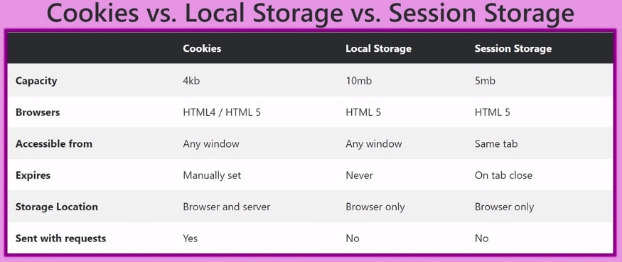

## Cookie
- 도메인 단위 접근 제한
- 만료기한이 있는 키,값 저장소
- 용량은 쿠키 하나당 최대 4KB
- 브라우저 또는 서버에서 저장할 수 있음
- 쿠키는 사용자가 따로 요청하지 않아도 HTTP 요청 헤더에 담겨 서버에 전송됨
- 구성요소
  - Name: 각각의 쿠키를 식별하는데 사용되는 이름
  - Value: Name에 해당하는 쿠키 값
  - Expires: 쿠키의 유지시간
  - Domain: 쿠키를 전송할 도메인
  - Path: 쿠키를 전송할 요청 경로
- 사용 예시
  - 쇼핑몰의 장바구니
  - 오늘 더 이상 보지 않음

## Session
- 방문자가 웹 서버에 접속해 있는 상태의 하나의 단위
- 쿠키와 달리 서버측에서 관리함
- 브라우저 종료시 삭제됨
- 서버에서 클라이언트를 구분하기 위해 세션 ID를 부여하고 사용자가 브라우저를 닫거나 로그아웃할 때, 세션 데이터는 일반적으로 서버에서 삭제됨
- 저장 데이터에 제한이 없으나 서버 자원을 사용함
- 사용 예시
  - 로그인 구현

## Session Storage
- HTML5 Web Storage
- 도메인 단위 접근 제한
- 용량 5MB
- 같은 탭에 한해 유효함
- 브라우저 종료시 삭제됨
- 사용 예시
  - 일시적으로 필요한 데이터 저장(일회성 로그인 정보, 입력폼 등)

## Local Storage
- HTML5 Web Storage
- 도메인 단위 접근 제한
- 별도로 지우지 않는한 영구적으로 저장됨
- 동일한 브라우저인 경우 브라우저가 종료되더라도 살아있음
- 사용 예시
  - 자동 로그인

---

# Reference
- [Javascript Local Storage Vs Session Storage Vs Cookies](https://dev.to/rohanshakya/javascript-local-storage-vs-session-storage-vs-cookies-95n)