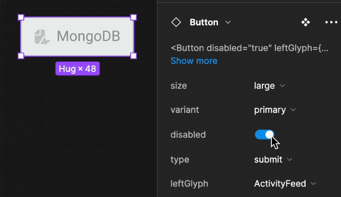

# Storybook
- 스토리북은 비즈니스 로직으로부터 분리된 독립적인 UI 컴포넌트를 만들 때 컴포넌트를 문서화 및 시각화하고 시뮬레이션 가능한 도구
- 디자인 시스템 개발 문서화가 용이하며 폼을 통해 시각적으로 변화를 적용하여 볼 수 있어 디자이너와 보다 쉬운 커뮤니케이션을 할 수 있음
- 중복적으로 사용되는 각각의 컴포너트를 어떻게 호출하고 props를 전달하는지 한 눈에 쉽게 알 수 있어 내가 만든 컴포넌트를 사용하는 동료의 개발경험 향상에 도움을 줌
- 자동으로 문서화해주는 기능을 제공하고 또한 mdx 문법을 통해 jsx를 렌더링하여 쉽게 컴포넌트 UI를 렌더링하는 문서를 작성할 수 있음
- 잘 갖춰놓은 디자인 시스템으로 시간 절약과 생산성 향상

## Story
- 스토리는 해당 컴포넌트를 렌더링하는 방법을 설명하는 방식
- 하나의 컴포넌트는 여러개의 스토리를 가질 수 있음

```ts
// 버튼을 사이즈별로 설명하는 스토리 예시
// 각각의 prop (argument)를 적용하여 렌더링 할 수 있음
export const Large: Story = {
  args: {
    size: 'large',
    label: 'Button',
  },
};

export const Small: Story = {
  args: {
    size: 'small',
    label: 'Button',
  },
};
```

```tsx
// button.tsx
// 아래와 같이 리액트 컴포넌트 props와 컴포넌트 변수명에 jsdoc 문법으로 주석을 작성하는 것만으로도 기본적인 문서를 만들 수 있음
interface ButtonProps {
    /**
     * What background color to use
     */
    backgroundColor?: string;
    /**
     * How large should the button be?
     */
    size?: 'small' | 'medium' | 'large';
    /**
     * Button contents
     */
    label: string;
    /**
     * Optional click handler
     */
    onClick?: () => void;
}

/**
 * Primary UI component for user interaction
 */
export const Button = ({
                           size = 'medium',
                           backgroundColor,
                           label,
                           ...props
                       }: ButtonProps) => {

    return (
        <button
            type="button"
    className={['storybook-button', `storybook-button--${size}`].join(' ')}
    style={{ backgroundColor }}
    {...props}
>
    {label}
    </button>
);
};
```

## Decorator
- 스토리북의 컴포넌트가 렌더링시 추가적으로 랩핑해주는 컴포넌트를 적용할 때 사용
- Story, Component, Global 각 레벨에 적용할 수 있음
    ```tsx
    // preview.tsx
    // 스토리북의 기본 구성파일인 preview.tsx 에서 글로벌 데코레이터 옵션을 정의하면 스토리북의 모든 컴포넌트가 렌더링될 때 데코레이터에 정의한 div로 감싸짐
    const preview: Preview = {
      decorators: [
        (Story) => (
          <div style={{ margin: '3em' }}>
            {/* 👇 Decorators in Storybook also accept a function. Replace <Story/> with Story() to enable it  */}
            <Story />
          </div>
        ),
      ],
    };
    
    export default preview;
    ```

## Controls
- Controls을 사용하면 QA 엔지니어, UI 엔지니어 또는 기타 이해 관계자가 컴포넌트의 한계를 시험해 볼 수 있음

## [Addons](https://storybook.js.org/integrations)
- 스토리북 페이지 내 툴바와 패널에 다양하고 유용한 확장 기능을 추가할 수 있음
- viewport addon: 다양한 viewport 크기를 설정하여 버튼을 클릭하여 특정 크기에서 어떤 형태로 UI가 보여지는지 확인가능 (반응형)
- anima addon(유료): 스토리를 작성한 컴포넌트를 피그마, 제플린 등에서 사용할 수 있도록 해주는 애드온. 이밖에 스토리북 배포,리뷰 등 다양한 애드온들이 존재
  



## 아토믹 디자인
- 아토믹 디자인은 디자인 시스템을 만드는 방법론 중 하나
- 아토믹 디자인은 원자 - 분자 - 유기체 템플릿 페이지 순으로 계층화
  - 원자: 더 이상 나눌 수 없는 기본 컴포넌트 input, button 등 HTML 기본 태그와 매칭됨
  - 분자: 두개 이상의 아톰을 결합한 형태, 단일책임원칙을 기준으로 유기체와 구분함 단일책임원칙을 적용함으로 재사용성과, 테스트하기 쉬운 조건의 이점을 가짐
  - 유기체: 분자와 원자를 결합한 형태
  - 템플릿: 컴포넌트를 배치하고 구조를 잡는 와이어프레임 (실제 컨텐츠x)
  - 페이지: 실제 데이터가 적용된 유저가 보는 컨텐츠

  
- 현실적으로 적용하기에 props drilling 같은 단점이 있어 상황에 맞게 적절히 적용할 필요가 있음

# Reference
- [아토믹 디자인을 활용한 디자인 시스템 도입기](https://fe-developers.kakaoent.com/2022/220505-how-page-part-use-atomic-design-system/)