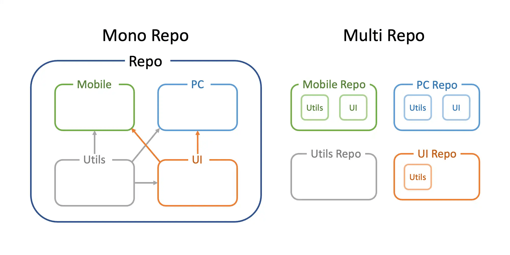

# 모노레포
프로젝트별로 레포지토리를 생성하여 만드는 멀티레포(또는 폴리레포)와 반대되는 방식으로, 버전 관리 시스템에서 두 개 이상의 프로젝트 코드가 동일한 저장소에 저장되는 소프트웨어 개발 전략



## 장점
- 여러 프로젝트 간의 코드의 공유와 재사용이 쉽다 (중복코드 감소)
- NPM 배포 없이 프로젝트 간에 코드 공유가 가능
- 동일한 lint, prettier, tsconfig 등의 설정을 공유하거나 확장할 수 있음
- 내가 담당하는 프로젝트가 아니더라도 자유롭게 의견을 주거나 수정을 할 수 있다
- 통일화된 개발환경으로 엔지니어들의 프로젝트 이동시 적응시간 감소


## 단점
- 긴 초기 프로젝트 설정시간
- 프로젝트가 많아질 수록 모든 프로젝트를 함께 빌드해야 하므로 빌드시간이 증가할 수 있다. (Turborepo 같은 추가도구를 점진적으로 적용하여 캐싱전략을 사용하여 개선)
- 하나의 프로젝트에서 발생한 변경 사항이 전체 시스템에 영향을 미칠 수 있다
- 여러 프로젝트가 하나의 레포지토리를 사용하기 때문에 개발이나 배포에 병목현상을 주지 않으려면 팀 구성원과 의논하여 적절한 브랜치 전략을 세울 필요가 있음

## 모노레포 구성을 도와주는 도구
크게 패키지 매니저를 사용한 구성방식과 (npm, yarn, pnpm) 
모노레포 빌드 시스템 도구를 같이 사용하여 구성하는 방식 (lerna, nx, Turborepo, rush 등) 두가지로 분류할 수 있다.

## Yarn Workspaces
Yarn Workspaces는 하나의 레포지토리에서 여러 패키지들을 편리하고 효율적으로 관리할 수 있게 해주는 기능이며 최상단의 package.json에 workspaces를 정의하고 yarn install을 실행하게 되면 최상단의 패키지, 그리고 workspaces에 정의된 패키지들을 설치하게 됩니다. 또한 패키지가 중복되는 경우 호이스팅을 통해 최상위에 설치하여 중복 설치를 방지(pnp)
### [📎 Code](https://github.com/dkd051/yarn-berry-workspace/blob/main/README.md)

```bash
npm install -g yarn # yarn 설치

mkdir yarn-berry-test # 프로젝트 폴더 생성

cd yarn-berry-test

yarn set version berry # 모노레포를 사용할 프로젝트의 루트 폴더에서 해당 명령어를 실행하여 yarn 2+ 버전 이상 설치

yarn init -w # packages 디렉토리 만들기 / 루트 초기화
```


```json5
// package.json
{
  "name": "yarn-berry-workspace",
  // ...
  "workspaces": [
    "apps/*", // yarn 워크스페이스에서 관리할 패키지 폴더를 추가
    "packages/*"
  ],
  // ...
}
```

```bash
yarn init # yarn init 명령어를 통해 apps와 packages 하위폴더 프로젝트에서 package.json 생성
```
```bash
├── apps
│   └── koo  # @koo/web (package.json name)
│       ├── README.md
│       ├── next-env.d.ts
│       ├── next.config.js
│       ├── package.json
│       ├── public
│       │   ├── favicon.ico
│       │   ├── next.svg
│       │   └── vercel.svg
│       ├── src
│       │   ├── pages
│       │   │   ├── _app.tsx
│       │   │   ├── _document.tsx
│       │   │   ├── api
│       │   │   │   └── hello.ts
│       │   │   └── index.tsx
│       │   └── styles
│       │       ├── Home.module.css
│       │       └── globals.css
│       └── tsconfig.json
├── package.json
├── packages
│   ├── lib  # @koo/lib (package.json name)
│   │   ├── README.md
│   │   ├── index.ts
│   │   ├── package.json
│   │   └── tsconfig.json
│   └── ui # @koo/ui (package.json name)
│       ├── README.md
│       ├── package.json 
│       ├── src
│       │   ├── Button.tsx
│       │   └── index.ts
│       └── tsconfig.json
├── tsconfig.base.json
└── yarn.lock
```

```bash
yarn # root 폴더에서 명령어를 실행 후 apps와 packages의 package.json 파일을 읽은 후 .pnp.cjs 숨김 파일을 갱신하여 이후 yarn에서 다중 패키지를 관리할 수 있게됨
```
```bash
yarn workspace @koo/web add @koo/lib # @koo/web 프로젝트에 @koo/lib 의존성을 추가. -> lib 내 정의한 함수를 사용할 수 있게됨

yarn workspace @koo/web add @koo/ui # @koo/web 프로젝트에 @koo/ui 의존성을 추가. -> ui에 정의한 Button 컴포넌트를 사용할 수 있게됨
```
```json5
// apps/koo/package.json
// @koo/lib와 @koo/ui 의존성이 추가됨
{
  //...
  "dependencies": {
    "@koo/lib": "workspace:^",
    "@koo/ui": "workspace:^",
    "next": "13.5.6",
    "react": "^18",
    "react-dom": "^18"
  },
  //...
}

```


# Reference
[모노레포 vs 멀티레포](https://velog.io/@miso1489/%EB%AA%A8%EB%85%B8%EB%A0%88%ED%8F%AC%EC%99%80-%EB%A9%80%ED%8B%B0%EB%A0%88%ED%8F%AC)

[[ETC] Monorepo - 개념](https://beomy.github.io/tech/etc/monorepo-concept/)